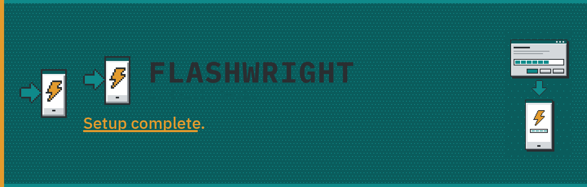
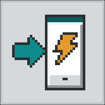
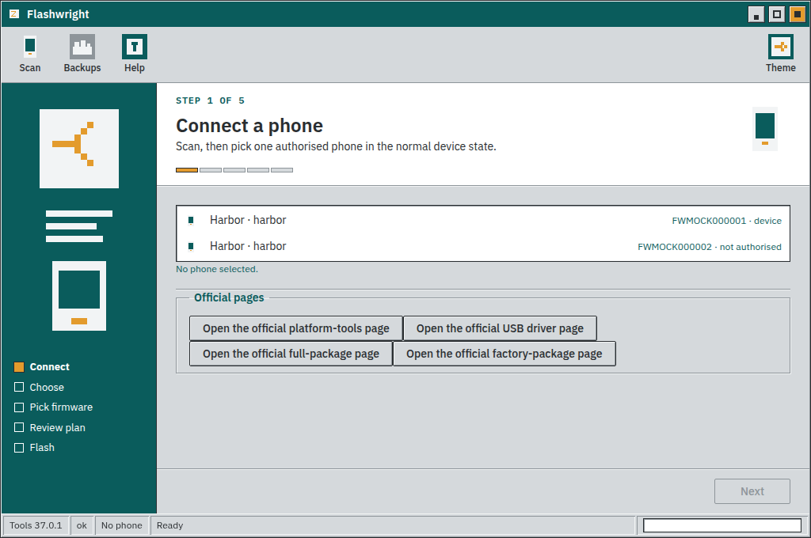
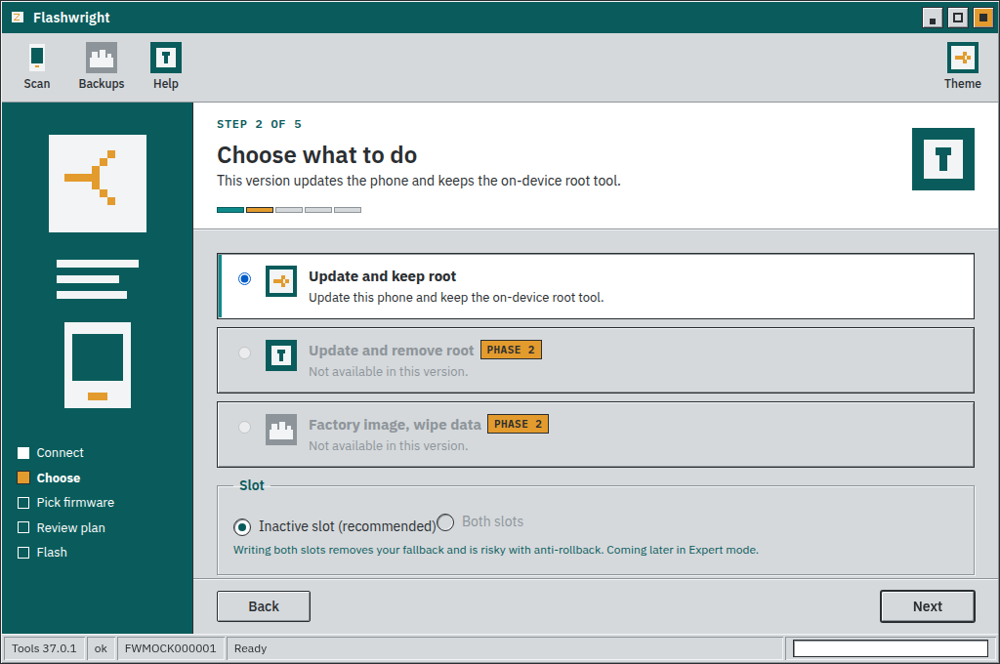
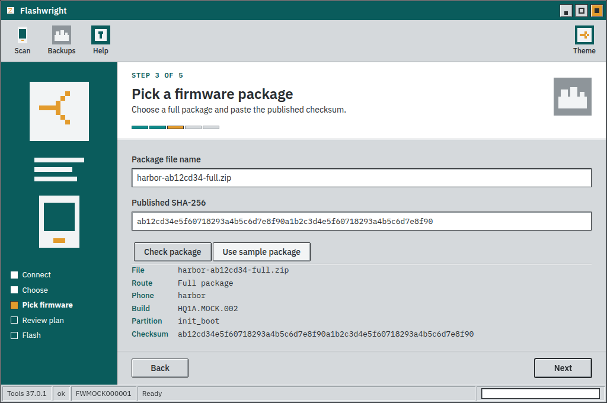
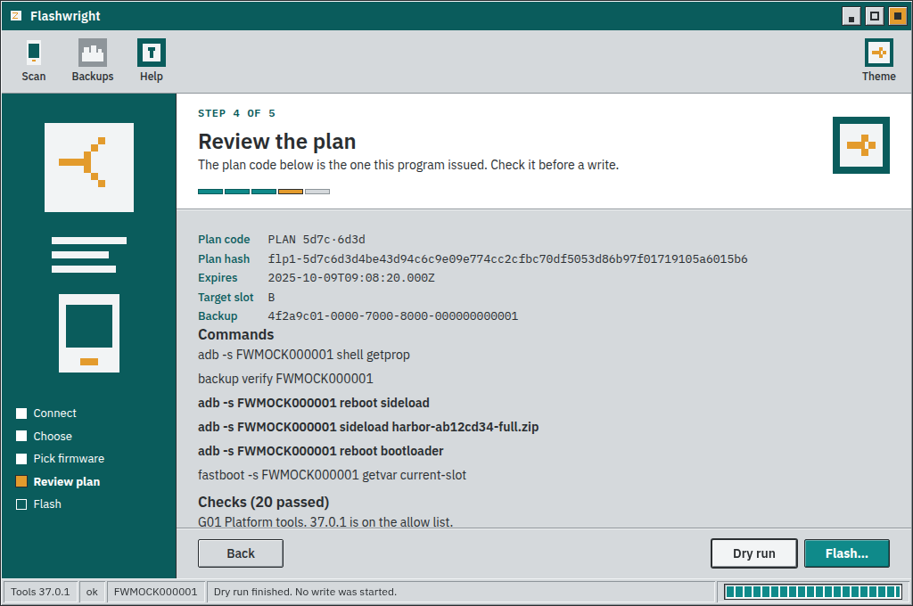
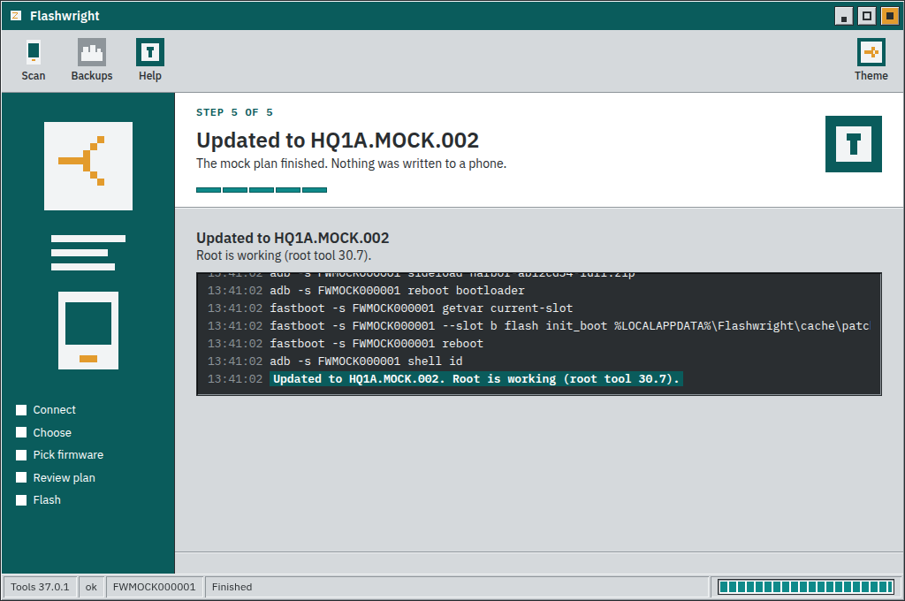
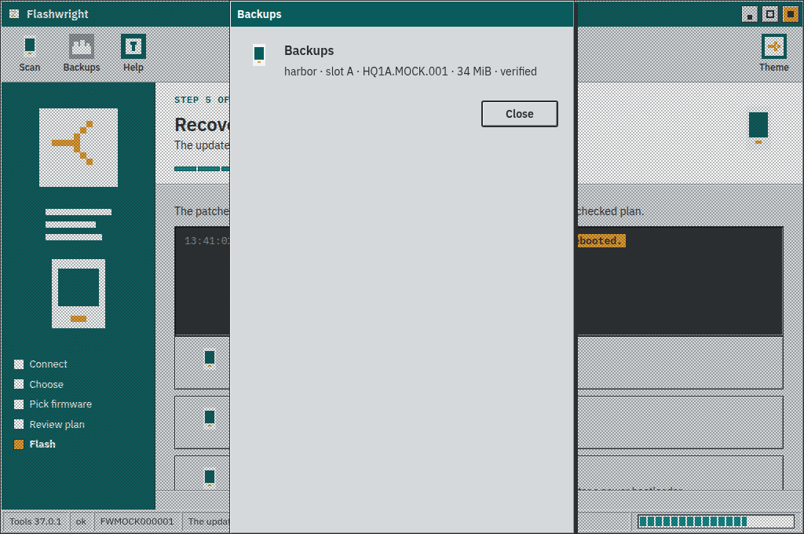

  

  

  
  
  

  <strong>Update, root and flash Android phones on Windows 11.</strong> 
  Flashwright is a Setup Wizard for Android phones, Google Pixel and others. 
  One guided path, from the moment you plug in to <strong>Setup complete.</strong>

## What it does

<table>
  <tr>
    <td align="center" width="33%" valign="top">
       
      <strong>Update</strong> 
      A monthly update that keeps root.
    </td>
    <td align="center" width="33%" valign="top">
       
      <strong>Root</strong> 
      Patch the boot image and install Magisk.
    </td>
    <td align="center" width="33%" valign="top">
       
      <strong>Flash</strong> 
      Flash a factory image. Each file shows its SHA-256.
    </td>
  </tr>
  <tr>
    <td align="center" valign="top">
       
      <strong>Backups</strong> 
      Boot and vbmeta, saved for you. Restore is one click.
    </td>
    <td align="center" valign="top">
       
      <strong>Dry-run preview</strong> 
      See what would run, or why it would be blocked. Nothing is written yet.
    </td>
    <td align="center" valign="top">
       
      <strong>Recovery</strong> 
      Re-flash a saved backup, or return the phone to stock.
    </td>
  </tr>
</table>

Expert mode keeps extra controls within reach.

## Status

A Pixel factory package or a full OTA package can be opened. Flashwright extracts init_boot, or boot on older phones, and checks the package hash. Safety checks run before a patch or a flash, and again before every write. They cover the phone, the factory image, the security patch, Magisk, the bootloader, and the slot. A dry run prints WOULD RUN or WOULD BLOCK and does not write. Stock init_boot is read, stored with a SHA-256, and compared with the factory image. A mismatch stops the job. The LU0 and FIPS regions are refused.

The Windows 11 wizard walks through connect, choose, firmware, review, and flash. A plan can be confirmed only from the review step, and only once. Platform-tools are not bundled. This build uses sample phones and does not write to a device.

Sign-off: M5 PROVISIONAL (mocks only). T1.3, T1.11, and T4.15 stay blocked until they are recorded on a phone.

Android, Google, and Pixel are trademarks of Google LLC. Magisk is a project by topjohnwu. They are named descriptively. Flashwright is not affiliated with or endorsed by them.

Platform-tools are located and version-checked before a scan. Writes stay off until an allow-list entry has per-file hashes and has been device-tested. A confirmed plan is single-use: Flashwright re-checks the phone and the input files, then discards the plan if either has changed.

## Features

- **Patch on your phone.** The Magisk app you already installed patches init_boot. You confirm "Patch on your phone?" before anything is copied to the phone.
- **PC check.** Flashwright reads the patched init_boot and checks that Magisk's init and the stock SHA-1 are present.
- **Pixel 9 Pro XL.** That phone (komodo) patches init_boot.

## Status

The patch step is exercised with sample command output. It does not talk to a phone. A hidden or renamed Magisk app stops the plan before any file is copied. The LU0 / FIPS region is refused.

## The wizard

<table>
  <tr>
    <td align="center" width="50%" valign="top">
       
      <strong>Connect</strong> 
      Plug the phone in. Flashwright shows the model, the build and the bootloader.
    </td>
    <td align="center" width="50%" valign="top">
       
      <strong>Choose</strong> 
      Monthly update and keep root, root the phone, flash firmware, or back up.
    </td>
  </tr>
  <tr>
    <td align="center" valign="top">
       
      <strong>Firmware</strong> 
      Pick a factory image. Every file is shown with its SHA-256.
    </td>
    <td align="center" valign="top">
       
      <strong>Dry-run</strong> 
      A preview of every image that would be written. Nothing is written yet.
    </td>
  </tr>
  <tr>
    <td align="center" valign="top">
       
      <strong>Done</strong> 
      The wizard finishes on Setup complete.
    </td>
    <td align="center" valign="top">
       
      <strong>Backups</strong> 
      Boot and vbmeta, kept on the PC, ready to restore.
    </td>
  </tr>
</table>

> Flashing can wipe data. Back up first.

  AGPL-3.0-or-later 
  Copyright (C) 2026 Jay Clatty (Clatty Works)

   
  <strong>Setup complete.</strong> 
  Made by <a href="https://github.com/contactjayclatty/clatty-works">Clatty Works</a>

