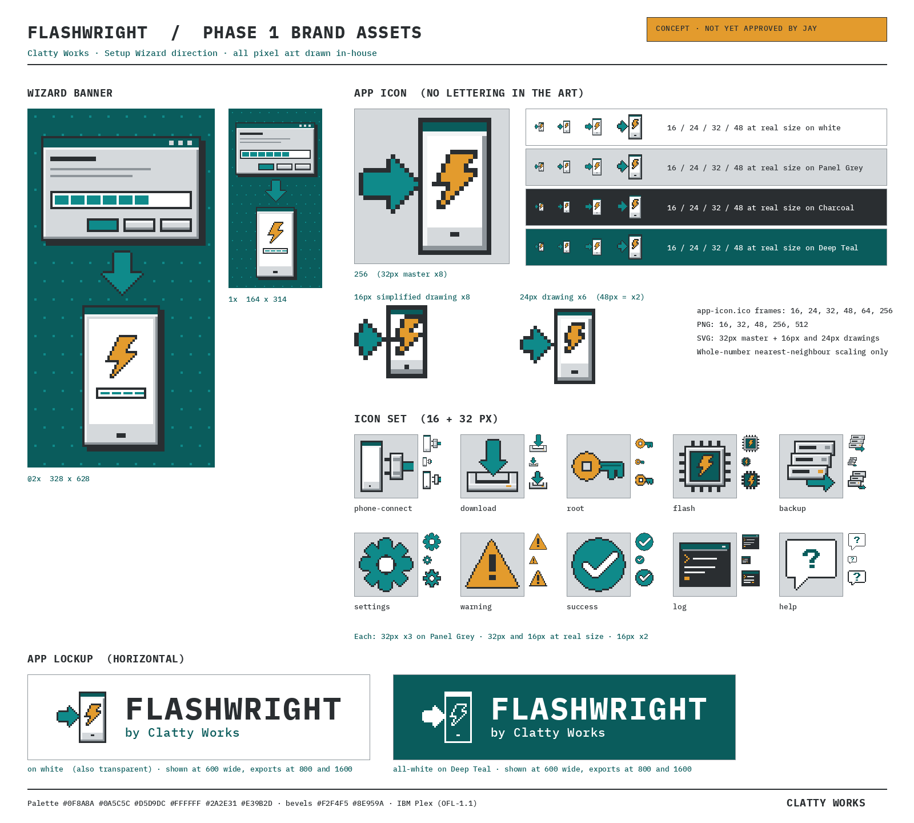

# Flashwright brand assets

Clatty Works brand assets for the Flashwright window: the UI skin, icons, wizard art, and app icon.

The app icon and banner have no lettering. The name appears in the lockup and in the window text.



## Files

| Path | What it is |
|---|---|
| `flashwright-ui.css` | A framework-free UI skin built from CSS custom properties. It has no dependencies, and the bevels are box-shadows. |
| `demo.html` | A static mock. Open `demo.html#connect`, `#choose`, `#flashing` or `#components`; with no fragment, it shows every page stacked. |
| `screenshots/demo-01-connect.png` | Step 1 of 5, Connect your phone (1280×800) |
| `screenshots/demo-02-choose.png` | Step 2 of 5, Choose what to do |
| `screenshots/demo-03-flashing.png` | Step 5 of 5, flashing, with progress, log, and the amber warning state |
| `screenshots/demo-04-components.png` | Component gallery: buttons, fields, meters, console, alert dialog |
| `icons/<name>-16.svg` / `.png`, `icons/<name>-32.svg` / `.png` | 10 pixel icons: `phone-connect`, `download`, `root`, `flash`, `backup`, `settings`, `warning`, `success`, `log`, `help` |
| `banner/wizard-banner.png` | Wizard side banner, 164×314 (1x) |
| `banner/wizard-banner@2x.png` | The same banner at 328×628 (@2x) |
| `banner/wizard-banner.svg` | Vector version (82×157 pixel grid, displays at 164×314) |
| `app-icon/app-icon.ico` | Windows icon with 16, 24, 32, 48, 64 and 256 frames |
| `app-icon/app-icon-{16,32,48,256,512}.png` | App icon PNGs with transparent backgrounds |
| `app-icon/app-icon.svg` | Master drawing on the 32px grid |
| `app-icon/app-icon-24.svg`, `app-icon/app-icon-16.svg` | Hand-simplified 24px and 16px drawings |
| `lockup/flashwright-lockup-horizontal.svg` | Horizontal app lockup, transparent background, text outlined to paths |
| `lockup/flashwright-lockup-horizontal-on-white.svg` | The same on a solid white background |
| `lockup/flashwright-lockup-horizontal-on-deep-teal.svg` | All-white version on Deep Teal |
| `lockup/flashwright-lockup-horizontal{,-on-white,-on-deep-teal}-{800,1600}.png` | PNG exports at 800×200 and 1600×400 |
| `flashwright-assets-sheet.png` | Preview sheet showing the banner, app icon at every size, and the icon set |
| `src/pixels.py` | Pixel grids for the icons, banner and app icon |
| `src/lockup.py` | Lockup builder |
| `src/build.py` | Build script |

## Using the skin

Link the stylesheet and put `class="fw-app"` on the root element:

```html
<link rel="stylesheet" href="flashwright-ui.css">
<body class="fw-app"> … </body>
```

The building blocks are below. `demo.html` shows the full markup for each one.

- **Window and panels:** `.fw-window`, `.fw-panel` (raised), `.fw-panel--sunken`
- **Title bar:** `.fw-titlebar` with `.fw-ctl--hide`, `.fw-ctl--size` and `.fw-ctl--close`. These are plain-square glyphs. Give each one an `aria-label`.
- **Toolbar:** `.fw-toolbar`, with `.fw-tool` buttons that use 32px icons and a label underneath. Add `.fw-tool--small` for 16px icons. `aria-pressed="true"` marks the active tool.
- **Buttons:** `.fw-btn`, plus `.fw-btn--default` for the Enter button, `.fw-btn--primary` for the teal action, and `:disabled`.
- **Fields:** `.fw-input`, `.fw-select`, and `.fw-check` wrapping a native `checkbox` or `radio`. Use `.fw-group` (a `fieldset`) for group boxes.
- **Status bar:** `.fw-statusbar` with `.fw-statusbar__cell`. Add `--warn` for the amber state.
- **Progress meter:** `.fw-meter` with `style="--fw-value:62"`, plus `--warn` and `--sm` variants. Also set `role="progressbar"` and `aria-valuenow`.
- **Wizard:** `.fw-wizard` contains the banner, the step list, the main column, and the footer.
- **Log:** `.fw-console`. The spans are `.t` (time), `.p` (command), `.ok`, `.warn` and `.cur`.
- **Alert:** `.fw-backdrop` containing `.fw-window.fw-dialog` (add `--warn` for the amber variant). Use `role="alertdialog"`.

**Theming:** override the `--fw-*` tokens in `:root`. A dark variant should only remap the `--fw-*` tokens.

**Fonts:** the CSS calls IBM Plex Sans and Plex Mono by name. Bundle the woff2 files (OFL-1.1) and add an `@font-face` block when packaging the app.

## Rules

- Never put Wizard Teal text on Panel Grey. Small teal text is always Deep Teal. White labels on Wizard Teal must be bold and at least 14px.
- Title bars are solid Deep Teal and never a gradient.
- Scale pixel art by whole numbers only, and set `image-rendering: pixelated` when you display it larger.
- No third-party marks, and no OS window glyphs, system icons, cursors or system fonts. The phone in the art is a generic slab.
- Icon colours stay inside the 8 brand colours.

**Lockup use:** the horizontal lockup goes in the app README header, About screen and splash. Keep clear space around it, show it at least 160px wide, and use the all-white version on Deep Teal or Charcoal. Don't recolour, stretch or re-letter it.

Clatty Works brand assets.
